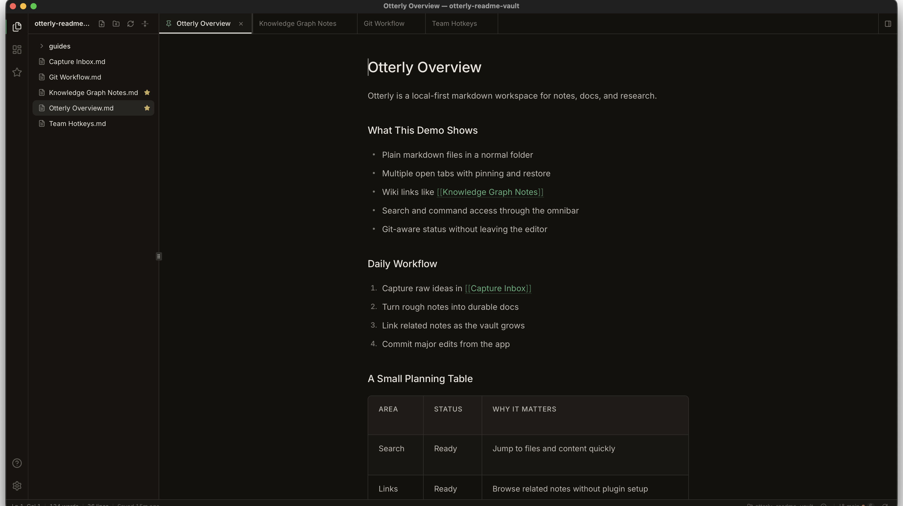
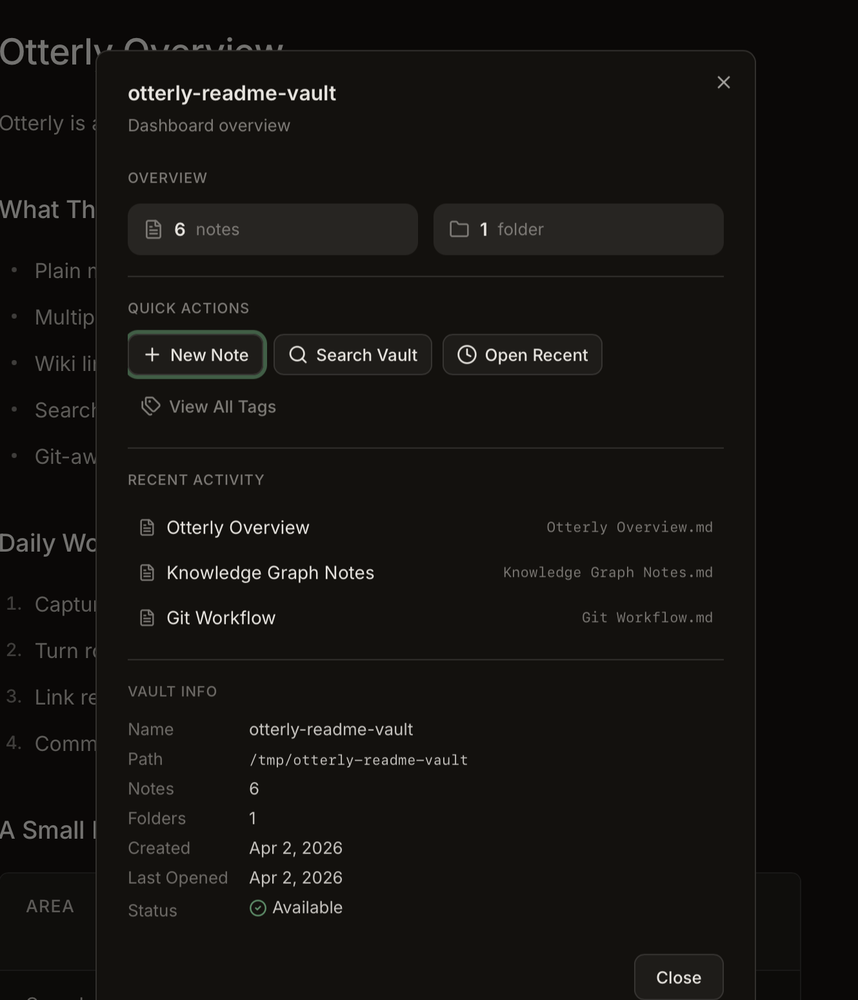
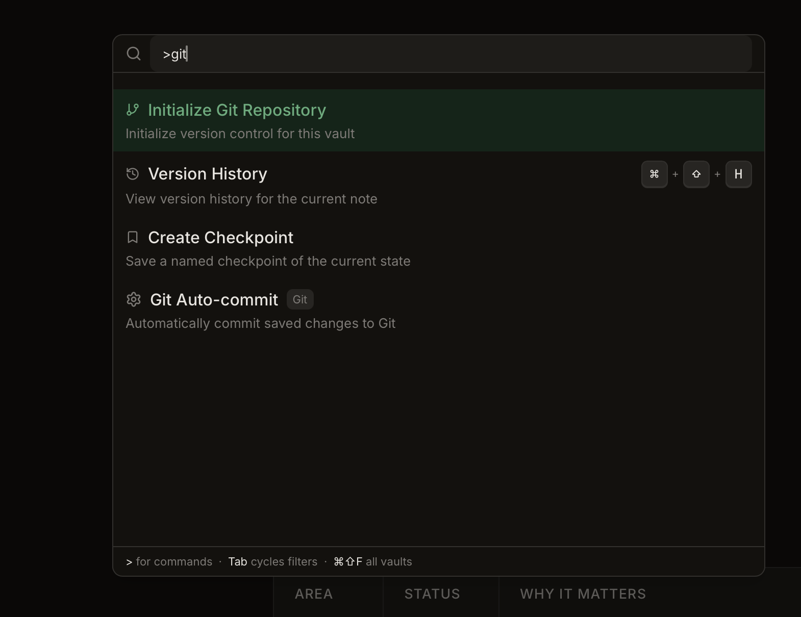
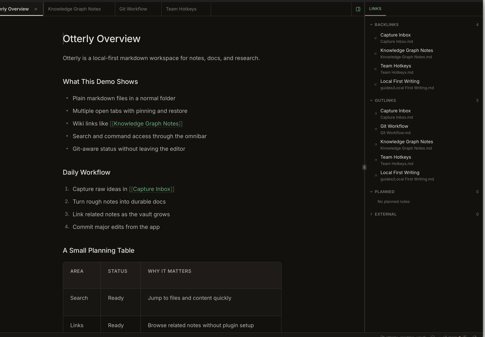
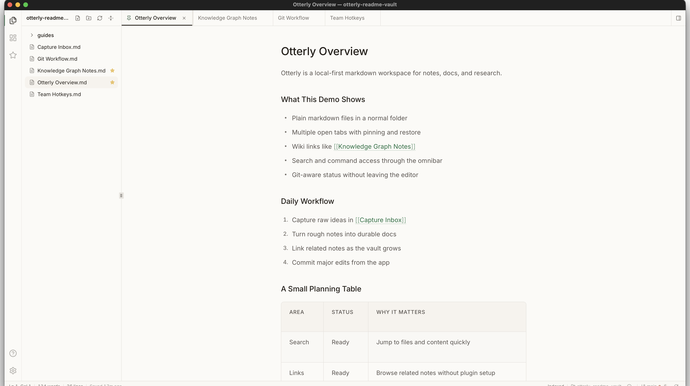

<p align="center">
  
</p>

<h1 align="center">LeapGrowNotes</h1>

<p align="center">
  <strong>24小时陪伴激励成长型知识笔记</strong><br/>
  本地优先 · 游戏化激励 · 电子宠物陪伴 · LLM 增强
</p>

<p align="center">
  
  
  
  
  
  
</p>

---

LeapGrowNotes 是一个**本地优先（local-first）**的个人知识库桌面应用，支持 Markdown、代码文件和纯文本。通过**游戏化积分系统**、**成长等级体系**和**电子宠物陪伴**，让知识管理变得有趣且可持续。采用**非 RAG** 架构（FTS5 全文搜索 + 结构化上下文注入），正在集成本地 LLM 和 LLM Wiki 知识编译引擎。

---

## 📸 截图

<table>
  <tr>
    <td></td>
    <td></td>
  </tr>
  <tr>
    <td align="center">📊 统计仪表盘 + SVG 图表</td>
    <td align="center">🔍 Omnibar 全文搜索</td>
  </tr>
  <tr>
    <td></td>
    <td></td>
  </tr>
  <tr>
    <td align="center">🔗 Wikilinks + Backlinks</td>
    <td align="center">📝 Markdown 编辑器</td>
  </tr>
</table>

---

## ✨ 核心功能

### 📝 知识管理

- **Markdown 编辑器**：Milkdown (ProseMirror) 所见即所得 + CodeMirror 6 代码块 + Prism 语法高亮
- **Wiki-links**：`[[wiki-links]]` 自动补全 + Backlinks/Outlinks 双向链接面板
- **全文搜索**：SQLite FTS5 全文检索（17 个搜索命令），中文 trigram 分词支持
- **文件树**：目录导航 + 拖拽排序 + 文件夹管理 + 作用域模式
- **Tab 系统**：多标签页 + 拖拽排序 + 固定标签 + 脏状态同步
- **Git 版本控制**：init / status / commit / history / checkpoint / restore / diff + 自动提交
- **收藏笔记**：星标笔记快速访问
- **代码索引**：正则提取函数名/类名/导出符号（Python/JS/TS/Rust/Go/Java/C/C++）

### 🎮 游戏化激励

- **积分系统**：10+ 种行为积分（打开文件/创建笔记/阅读完成/搜索/NLP 分析等），SQLite + Rust 引擎
- **成长等级**：30 级体系（👶 知识新生儿 → 🎒 小学生 → 🎓 博士 → 👑 院士），模拟中国教育成长路径
- **成就徽章**：10 枚徽章（🌅 早起鸟 / 🦉 夜猫子 / 📖 阅读马拉松 / 🔥 连续 30 天 等）
- **升级动画**：confetti 烟花 + 飘动积分(+2) 动画
- **连续天数**：🔥 连续使用追踪 + 动态计时器显示

### 🐾 电子宠物系统 (v2.0.0)

- **5 种宠物**：墨灵 🐱 / 卷卷 🐶 / 码仔 🐵 / 思思 🦊 / 芽芽 🐰，对应不同学习风格
- **4 阶段进化**：幼崽期 → 成长期 → 成熟期 → 传说期（50 级等级系统）
- **互动系统**：喂食（5 种知识食物 + 冷却机制）+ 互动（摸头/玩耍/对话）
- **心情系统**：8 种心情 + 时间衰减机制
- **积分联动**：学习行为 → 宠物获得经验值 → 宠物成长进化（pet_sync reactor）
- **选蛋孵化**：选蛋 UI + 取名 + 孵化动画

### 🧠 NLP 分析

- **纯 Rust 分析**：词频统计 / 关键词提取 / 段落结构 / 代码块检测 / 链接分析 / 词汇丰富度
- **Python NLP 桥接（PyO3）**：jieba 中文分词 / 情感分析（字典法）/ 规则 NER（EMAIL/URL/DATE）/ ML NER（ModelScope StructBERT 中文 PER/ORG/LOC/TIME）
- **BPE Token 分析**：Token 可视化 + 压缩比 + 高频 Token 分布
- **聚合统计**：全 vault NLP 数据汇总仪表盘

### 👤 用户系统

- 多用户登录 / 注册 / 游客模式
- 密码管理 + 用户切换
- 个性化设置（头像/语言/侧边栏偏好）

### 🎨 界面与体验

- 明/暗主题 + 自定义主题（色调/字体/间距/代码块样式 等 40+ 参数）
- 可重绑定快捷键系统
- 自动更新检查（Tauri Updater 插件）
- 文件变更实时监控（watcher reactor）
- 窗口标题动态更新

---

## 🏗 技术栈

| 层级 | 技术 | 说明 |
| --- | --- | --- |
| 前端框架 | SvelteKit + Svelte 5 (runes) + TypeScript | `$state` / `$derived` / `$effect` 响应式 |
| UI 组件 | shadcn-svelte + Tailwind CSS | 无头组件 + 原子化样式 |
| 编辑器 | Milkdown (ProseMirror) + CodeMirror 6 + Prism | WYSIWYG + 代码块 + 语法高亮 |
| 桌面打包 | Tauri 2 | Rust 后端，~10MB 安装包 |
| 后端语言 | Rust (86 个 Tauri 命令) | 高性能文件操作/索引/积分/宠物引擎 |
| 数据库 | SQLite (rusqlite) + FTS5 | 元数据 + 全文搜索 + trigram 中文分词 |
| NLP | 纯 Rust 实现 + Python 桥接 (PyO3) + BPE | 双层 NLP 架构 |
| Git | git2 crate | 本地版本控制 + 自动提交 |
| 跨平台 | macOS / Windows / Linux | Tauri 2 多平台打包 |

---

## 🏛 系统架构

前端采用 **Ports + Adapters + Stores + Services + Reactors** 五层分离架构，通过 **Action Registry** 统一调度：

```
┌──────────────────────────────────────────────────┐
│  UI  (Svelte 5 + shadcn-svelte)                  │
│  Reads stores via $derived.                      │
│  Triggers actions via action_registry.execute()  │
└────────────────────┬─────────────────────────────┘
                     │
          ┌──────────▼──────────┐
          │   Action Registry   │  统一调度入口
          └──────────┬──────────┘
                     │
          ┌──────────▼──────────┐
          │      Services       │  异步编排 + IO 调用
          └───────┬─────┬───────┘
                  │     │
       ┌──────────▼┐   ┌▼──────────┐
       │   Stores   │   │   Ports   │  IO 接口抽象
       │  ($state)  │   │ (interf.) │  Adapters 实现
       └──────┬─────┘   └───────────┘
              │
  ┌───────────┴───────────┐
  │                       │
┌─▼────────┐       ┌─────▼──────────┐
│ UI reads │       │    Reactors    │  $effect.root() 观察者
│ $derived │       │ (side effects) │  17 个响应式 reactor
└──────────┘       └────────────────┘
```

详见 [`design/02_ARCHITECTURE.md`](design/02_ARCHITECTURE.md)。

---

## 📦 后端模块（86 个 Tauri 命令）

| 模块 | 命令数 | 说明 |
| --- | --- | --- |
| `vault` | 6 | Vault 管理（打开/列出/移除/记忆） |
| `notes` | 14 | 笔记 CRUD + 文件夹管理 + 资产管理 |
| `search` | 17 | FTS5 全文搜索 + 链接解析 + 索引管理 |
| `git` | 7 | Git init/status/commit/history/checkpoint/restore/diff |
| `settings` | 4 | 全局设置 + Vault 设置 |
| `stats` | 5 | 会话统计（开始/结束/文件打开/读完/历史） |
| `points` | 4 | 积分奖励/查询/交易流水/成就 |
| `pets` | 10 | 宠物创建/查询/喂食/互动/经验/进化/心情/库存 |
| `nlp_kernal` | 9 | NLP 分析 + BPE Token 分析 + 聚合统计 |
| `user` | 4 | 用户管理（创建/查询/更新/密码验证） |
| `update` | 2 | 自动更新检查 + 安装 |
| `watcher` | 2 | 文件变更监控（启动/停止） |
| `vault_session` | 2 | 会话持久化（保存/恢复） |

### 前端 Reactors（17 个）

| Reactor | 说明 |
| --- | --- |
| `autosave` | 自动保存脏文件 |
| `backlinks_sync` | 反向链接同步 |
| `editor_sync` | 编辑器内容同步 |
| `editor_width` | 编辑器宽度响应 |
| `find_in_file` | 文件内搜索 |
| `git_autocommit` | Git 自动提交 |
| `local_links_sync` | 本地链接同步 |
| `pet_sync` | 宠物经验值同步 |
| `session_persist` | 会话持久化 |
| `starred_persist` | 收藏持久化 |
| `tab_dirty_sync` | Tab 脏状态同步 |
| `theme` | 主题切换 |
| `watcher` | 文件变更监控 |
| `window_title` | 窗口标题更新 |
| `app_close_request` | 应用关闭请求处理 |
| `conflict_toast` | 冲突提示 |
| `op_toast` | 操作提示 |
| `recent_commands_persist` | 最近命令持久化 |
| `recent_notes_persist` | 最近笔记持久化 |
| `user_folder_persist` | 用户文件夹持久化 |

### 前端 Feature 模块（20 个）

`clipboard` · `editor` · `folder` · `git` · `hotkey` · `links` · `nlp_kernal` · `note` · `pets` · `search` · `session` · `settings` · `shell` · `stats` · `tab` · `theme` · `update` · `user` · `vault` · `watcher`

---

## 📊 项目状态

### 已完成 (v2.1.0)

| 阶段 | 状态 | 说明 |
| --- | --- | --- |
| Phase 1: MVP | ✅ 完成 | Tauri 2 脚手架 + 文件系统 + Milkdown 编辑器 + FTS5 搜索 |
| Phase 1.5: 用户与激励 | ✅ 完成 | 多用户 + 积分 + 30 级成长 + 统计仪表盘 + NLP + 自动更新 |
| Phase 5: 电子宠物 | ✅ 完成 | 5 种宠物 + 4 阶段进化 + 喂食/互动/心情 + 积分联动 |

### 开发中 / 规划中

| 阶段 | 状态 | 说明 |
| --- | --- | --- |
| Phase 2: LLM 集成 | ❌ 未开始 | 本地 LLM (Qwen2.5 + llama.cpp) + 摘要/语义搜索/问答 |
| Phase 2.5: LLM Wiki | ❌ 未开始 | LLM 驱动的持久化知识 Wiki 引擎（Karpathy 模式） |
| Phase 3: 多设备同步 | 🔶 部分完成 | Git 手动提交已有，auto push/pull + 冲突解决未实现 |
| Phase 4: 增强功能 | 🔶 部分完成 | Wikilinks 已有，图谱可视化/插件系统/移动端未实现 |

---

## 📚 设计文档

所有设计文档位于 `design/` 目录，共 13 份：

| 编号 | 文档 | 说明 | 状态 |
| --- | --- | --- | --- |
| 01 | [BLUEPRINT](design/01_BLUEPRINT.md) | 项目蓝图与总体规划 | ✅ |
| 02 | [ARCHITECTURE](design/02_ARCHITECTURE.md) | 系统架构设计（五层分离 + Action Registry） | ✅ |
| 03 | [GAP_ANALYSIS](design/03_GAP_ANALYSIS.md) | Gap 分析与迭代计划 | ✅ |
| 04 | [UI](design/04_UI.md) | UI 设计系统（40+ 主题参数） | ✅ |
| 05 | [POINTS_SYSTEM](design/05_POINTS_SYSTEM.md) | 积分系统设计 | ✅ 已实现 |
| 06 | [GROWTH_LEVELS](design/06_GROWTH_LEVELS.md) | 30 级成长等级体系 | ✅ 已实现 |
| 07 | [BADGES](design/07_BADGES.md) | 10 枚成就徽章系统 | ✅ 已实现 |
| 08 | [PET_SYSTEM_DESIGN](design/08_PET_SYSTEM_DESIGN.md) | 电子宠物系统完整设计 | ✅ 已实现 |
| 09 | [NLP_VALUE_PLAN](design/09_NLP_VALUE_PLAN.md) | NLP 价值导向规划（子包取舍矩阵） | ✅ |
| 10 | [NLPTRACK](design/10_NLPTRACK.md) | NLP 功能使用追踪 | ✅ |
| 11 | [LOCAL_LLM_NLU](design/11_LOCAL_LLM_NLU.md) | 本地 LLM/NLU 技术方案（Qwen2.5 + llama.cpp） | 📋 规划中 |
| 12 | [UPDATE_SYSTEM_DESIGN](design/12_UPDATE_SYSTEM_DESIGN.md) | 自动更新模块设计 | ✅ 已实现 |
| 13 | [LLM_WIKI](design/13_LLM_WIKI.md) | LLM Wiki 知识编译引擎（Karpathy 模式） | 📋 规划中 |

---

## 🧪 测试

项目包含前端和后端双层测试：

### 前端测试 (Vitest)

```
tests/
├── adapters/          # 13 个测试适配器（mock Tauri IPC）
│   ├── test_notes_adapter.ts
│   ├── test_search_adapter.ts
│   ├── test_git_adapter.ts
│   └── ...
└── unit/              # 按领域分层
    ├── actions/       # Action 测试
    ├── adapters/      # 适配器测试
    ├── db/            # 数据库测试
    ├── domain/        # 领域逻辑测试
    ├── helpers/       # 工具函数测试
    ├── hooks/         # Hook 测试
    ├── reactors/      # Reactor 测试
    ├── services/      # Service 测试
    ├── stores/        # Store 测试
    └── utils/         # 通用工具测试
```

### 后端测试 (Rust)

```
src-tauri/tests/
├── link_rewrite.rs              # 链接重写测试
├── notes_service_safety.rs      # 笔记服务安全测试
├── pets_engine.rs               # 宠物引擎测试（33 个测试）
├── search_db_behavior.rs        # 搜索数据库行为测试
├── vault_session_service_parse.rs
└── vault_settings_service_parse.rs
```

---

## 🔮 路线图

### 近期（2026 Q2）

- [ ] **本地 LLM 集成**：Qwen2.5-1.5B (GGUF) + llama-cpp-rs + Metal GPU 加速
  - 笔记摘要生成（< 3s）
  - 智能标签建议
  - 语义搜索（BGE-small-zh Embedding）
  - 基于笔记的问答
- [ ] **LLM Wiki 引擎**：LLM 驱动的持久化知识 Wiki（Karpathy LLM Wiki 模式）
  - 源笔记增量摄入 → 自动构建结构化 Wiki
  - 实体/概念/摘要/分析页面自动生成与维护
  - 交叉引用、矛盾检测、健康检查
  - Wiki 浏览器 + 关系图谱可视化

### 中期

- [ ] **Git 远程同步**：auto push/pull + 冲突检测与解决 UI
- [ ] **笔记图谱可视化**：力导向图展示笔记关系
- [ ] **LLM 对话面板**：支持 OpenAI / Claude / DeepSeek / Ollama 多后端
- [ ] **流式输出**：LLM 回答实时流式渲染

### 远期

- [ ] **插件系统**：可扩展的功能插件架构
- [ ] **移动端**：Tauri 2 iOS/Android 支持
- [ ] **多 Wiki 支持**：一个 vault 多个主题 Wiki
- [ ] **协作功能**：多人实时编辑

---

## 🚀 开发

### 环境要求

- **Node.js** ≥ 18
- **pnpm** ≥ 8
- **Rust** (stable，通过 rustup 安装)
- **Tauri CLI** (`cargo install tauri-cli`)
- macOS: Xcode Command Line Tools
- Windows: Visual Studio Build Tools
- Linux: `libwebkit2gtk-4.1-dev` + `libappindicator3-dev`

### 快速开始

```bash
# 克隆项目
git clone https://github.com/JieGaoPrinceton/LeapGrowNotes.git
cd LeapGrowNotes

# 安装前端依赖
pnpm install

# 开发模式（热重载）
pnpm tauri dev

# 构建发布包
pnpm tauri build
```

### 常用命令

```bash
# 前端
pnpm check              # TypeScript 类型检查
pnpm lint               # oxlint + 分层规则检查
pnpm test               # Vitest 单元测试
pnpm build              # 前端构建

# 后端（在 src-tauri/ 目录下）
cargo check              # Rust 类型检查
cargo test               # Rust 单元测试
cargo clippy             # Rust lint

# 发布
./scripts/release.sh     # 完整发布流程
```

### 项目结构

```
LeapGrowNotes/
├── src/                          # 前端源码 (SvelteKit + Svelte 5)
│   ├── lib/
│   │   ├── app/                  # 应用入口 + Action Registry + DI
│   │   ├── components/ui/        # UI 组件 (shadcn-svelte)
│   │   ├── features/             # 20 个功能模块
│   │   │   ├── editor/           #   编辑器
│   │   │   ├── search/           #   搜索
│   │   │   ├── pets/             #   电子宠物
│   │   │   ├── git/              #   Git 集成
│   │   │   └── ...               #   更多模块
│   │   ├── hooks/                # Svelte hooks
│   │   ├── reactors/             # 17+ 个响应式 reactor
│   │   └── shared/               # 共享工具/类型/常量
│   ├── routes/                   # SvelteKit 路由
│   └── styles/                   # 全局样式 + 设计令牌
│
├── src-tauri/                    # 后端源码 (Rust + Tauri 2)
│   ├── src/
│   │   ├── app/                  # 应用状态管理
│   │   ├── features/             # 后端功能模块
│   │   │   ├── git/              #   Git (git2)
│   │   │   ├── notes/            #   笔记 CRUD
│   │   │   ├── search/           #   FTS5 搜索
│   │   │   ├── pets/             #   宠物引擎
│   │   │   ├── nlp_kernal/       #   NLP + Python 桥接
│   │   │   ├── points/           #   积分引擎
│   │   │   └── ...               #   更多模块
│   │   └── shared/               # 共享工具
│   └── tests/                    # Rust 集成测试
│
├── design/                       # 13 份设计文档
├── tests/                        # 前端测试
├── scripts/                      # 构建/发布脚本
├── nlp_db/                       # NLP 数据库文件
└── pets/                         # 宠物资源文件
```

---

## 📜 版本历史

| 版本 | 日期 | 主要变更 |
| --- | --- | --- |
| **2.1.0** | 2026-05-02 | 设计文档体系重组 + LLM Wiki 设计文档 + 本地 LLM 技术方案 |
| **2.0.0** | 2026-05-01 | 🐾 电子宠物系统完整上线（5 宠物/4 进化/喂食/互动/心情） |
| **1.0.0** | 2026-05-01 | 多用户系统 + 积分引擎 + 成长等级 + 统计仪表盘 + 自动更新 |
| **0.3.1** | 2026-04-30 | 基线版本：编辑器 + 文件管理 + NLP + Git + 搜索 + 主题 |
| **0.2.0** | 2026-04-28 | 用户系统 + 积分/等级原型 + 统计仪表盘 |
| **0.1.0** | 2026-04-25 | 项目初始化（基于 Otterly 模板） |

---

## 🙏 致谢

- [Otterly](https://github.com/ajkdrag/otterly) — 项目基座（MIT 许可）
- [Milkdown](https://milkdown.dev/) — Markdown 编辑器框架
- [Tauri](https://tauri.app/) — 跨平台桌面应用框架
- [shadcn-svelte](https://www.shadcn-svelte.com/) — UI 组件库
- [Andrej Karpathy](https://gist.github.com/karpathy/442a6bf555914893e9891c11519de94f) — LLM Wiki 模式灵感

---

## 📄 许可证

MIT License — 详见 [LICENSE](LICENSE)
